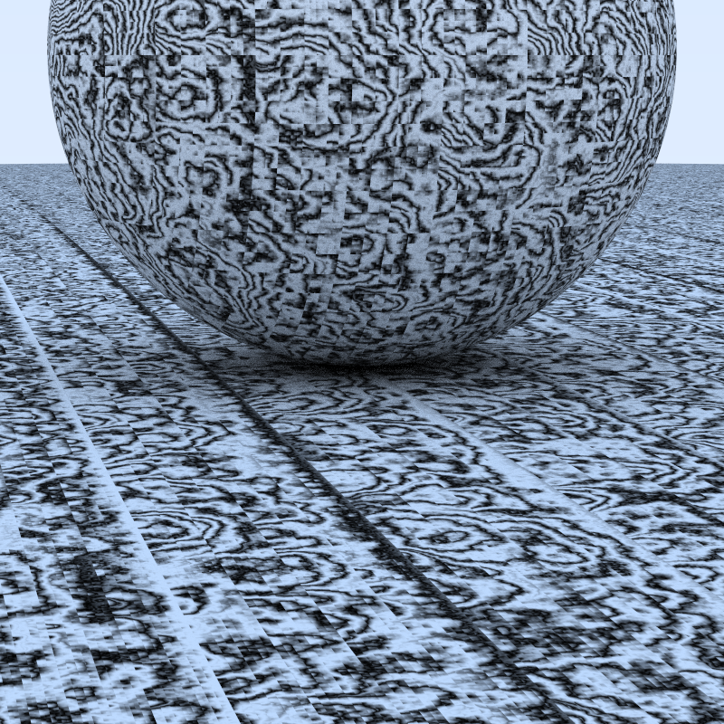
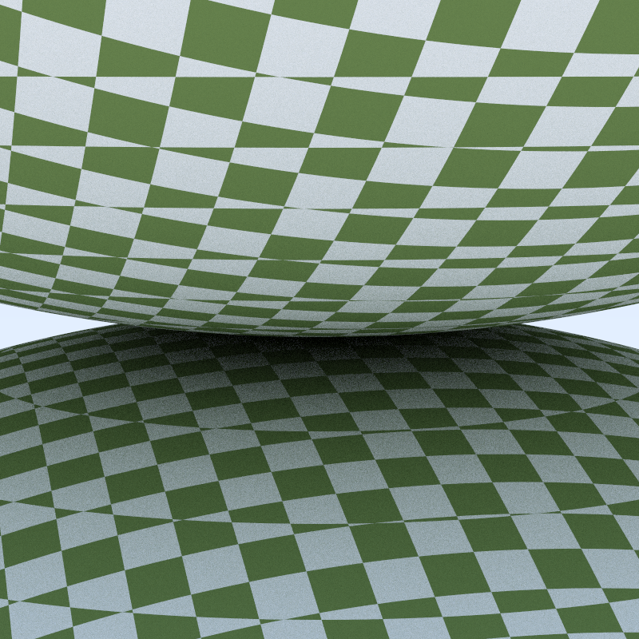
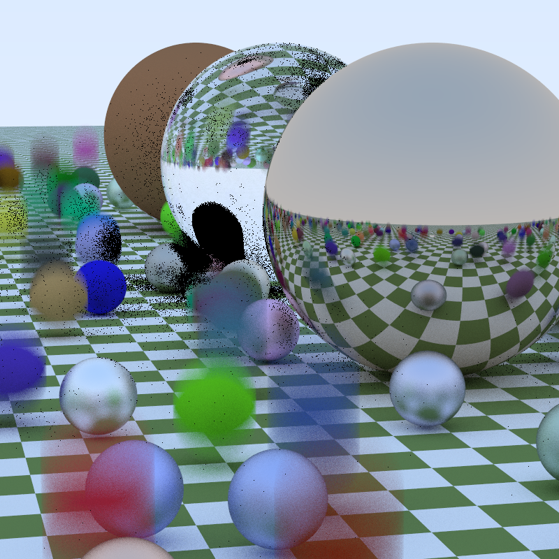

# Raytracer
Heavily inspired from https://raytracing.github.io/, book 1 and 2.

For changing parameters such as width, height, ray depth or the number of workers, you have to modify the code directly.
Make sure to run in release mode to avoid having lots of logs printed in stderr.
When the image is fully displayed, hit S to save in "image.png" in the current directory.

For choosing the scene, set the environment variable **SCENE** to:

* **MARBLE** if you want this:

There is currently a problem with MARBLE, I don't remembered what parameters I had to get this beautiful picture, sorry 🥲

* **SPHERES** if you want this:

* **RANDOM** if you want this:

The black point are points where the max depth is too small. Blur represents "moving" balls, though it may too pronounced sometimes.
